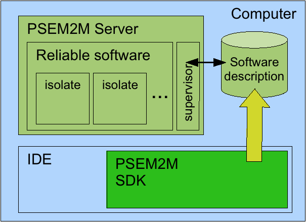
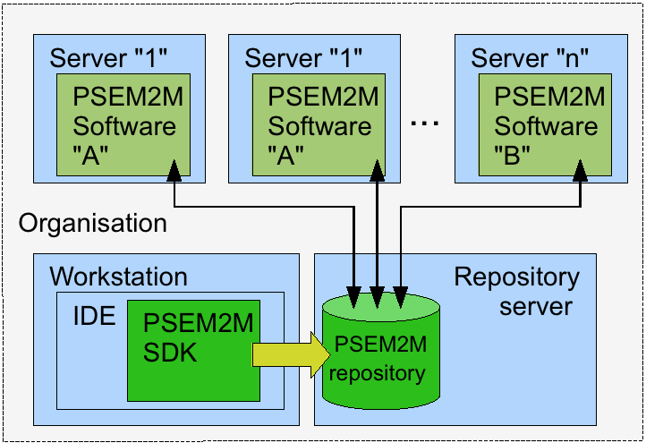

.. comment:

Architecture
************

Les différents composants
=========================

La plate-forme est composée de deux sous ensembles :

- un environnement de production de logiciel (SDK)

  - Plugins Eclipse, ...

- un serveur d'exécution de logiciel

   
Un ensemble de serveurs d'exécution déployés dans une même organisation pourront être fédérés autour d'un « repository » destiné à centraliser les définitions de logiciels et les composants à déployer.

Un simple serveur http pourra faire office de « repository » 

Le serveur d'exécution
======================

Un serveur d'exécution est un ensemble d'isolats.

Chacun des isolats assure un rôle : « master », « forker » ou « slave ».

Au moins l'un d'eux à le statut de « master ».

Le premier isolat lancé d'un serveur d'exécution est un isolat « master ».

Ci après le rôle et le comportement de chacun :

Les isolats « master »
----------------------

Un isolat « master » est est lancé avec la variable d'environnement « org.psem2m.isolates.kind » contenant la valeur « master ».

Un isolat « master » contient un bundle « master.manager » en charge de piloter l'application.

Plusieurs isolats « master » peuvent cohabiter pour assurer la redondance du pilotage de l'application.

La tâche principale du bundle « master.manager » est d'obtenir le descripteur du logiciel auprès du service de configuration d'en déduire les consignes de lancement des isolats composant le logiciel et de les mettre en œuvre.

Pour lancer les isolats « slave », le « master.manager » s'adresse à l'isolat « forker » qui embarque un outillage spécialisé dépendant du système d'exploitation de la plate-forme d'exécution.

Il n'y a qu'un seul isolat « forker » par serveur d'exécution, les multiples isolats « master » le démarre le cas échéant lorsqu'ils en ont besoin, le « forker » ne traite qu'une seule demande à la fois pour garantir que les demandes de lancement d'isolat ne soit pas doublées.

A la fin de leur lancement, les isolats « slave » avertissent le « forker » de leur état et celui-ci en averti les « master.manager » des différents isolats « master »

Le bundle « master.monitor » de chaque isolat « master » va établir un lien JMX avec la JVM du nouvel isolat « slave »

Note : Dans Java SE 6, il n'est plus nécessaire de définir de propriété système pour activer l'agent JMX d'une JVM, n'importe quelle application lancée avec Java SE 6 peut être administrée en local.

Le bundle « master.monitor » surveille les métriques de chaque isolat par rapport au consignes présentes dans le descripteur du logiciel.
En cas de nécessité, le bundle « master.monitor » sollicitera le « master.manager » pour arrêter un isolat.

Note : dans une version utltérieure intégrant l'aspect « autonomic computing » le « master.manager » calculera un nouvelle configuration du logiciel et en déduira les arrêts et relances nécessaires.

Les isolats « slave »
---------------------

Un isolat « slave » est lancé avec la variable d'environnement « org.psem2m.isolates.kind » contenant la valeur « slave ».

Chaque isolat typé « slave » démarre un « slave.agent ». Cet agent va publier des Mbeans JMX pour rendre accessible les métriques de l'isolat ainsi que tous les évènements d'arrêt et démarrage ( bundles et services).

L'agent est aussi à l'écoute des signaux du système sous-jacent pour pouvoir être proactif lors des terminaison de programme (cf.
traitement sur SIGTERM).

Après avoir démarré leur agent, les isolats typés « slave » démarrent un « slave.manager ».

La tâche principale du « slave.manager » est d'obtenir le descripteur de l'isolat auprès du service de configuration d'en déduire les consignes de chargement de bundle et de les mettre en œuvre.

Le « slave.manager » sollicite le provisionneur pour approvisionner les bundles dans le cache de l'isolat pour ensuite demander leur chargement à la plateforme OSGI.

L'isolat « forker »
-------------------

Un isolat « forker » est est lancé avec la variable d'environnement « org.psem2m.isolates.kind » contenant la valeur « forker ».

Il n'y a qu'un seul isolat « forker » dans un serveur d'exécution.

Cet isolat est lancé par les bundle « master.manager » qui en ont besoin.

Pour garantir l'unicité de l'isolat « forker », le « master.manager » lanceur, pose un verrou en s'appuyant sur une ressource du système d'exploitation de la plate-forme d'exécution (ex.
création d'un fichier « forker.starting »).

Les « master.manager » dialoguent avec l'isolat « forker » via JMX pour passer les commandes de lancement ou de suppression des isolats « slave ».

Pour les plate-formes ne permettant pas de cloner un processus complet (cf.
forkall() de Solaris), l'isolat forker utilise un pool d'isolats non spécialisés lancés en avance de phase.

Un isolat non spécialisé est une JVM contenant un framework OSGI (ex : Felix) démarré et prêt à l'emploi.

les services utilitaires
------------------------

Le service de configuration
^^^^^^^^^^^^^^^^^^^^^^^^^^^

Ce service est le premier lancé dans chaque isolat.
Tous les autres services s'adressent à lui pour obtenir leurs paramètres de fonctionnement.

Ce service fourni une interface d'accès à un dictionnaire.

Publié par le bundle : org.psem2m.isolates.base.config

les services de diagnostique
^^^^^^^^^^^^^^^^^^^^^^^^^^^^

Ce service est le deuxième lancé dans chaque isolat.
Tous les composants ou services de l'isolat s'adressent à lui pour ouvrir des canaux de consignation d'activité qui se déversent dans des fichiers.

Dynamiquement ces canaux peuvent être redirigés vers un serveur de trace accessible par le réseau.

Publiés par le bundle : org.psem2m.isolates.diagnoser

le service de provisionnement
^^^^^^^^^^^^^^^^^^^^^^^^^^^^^

Tous les isolats « slave » embarquent un bundle « isolates.provisionner » en charge de récupérer les bundles auprès d'un pourvoyeur qui pourra être un simple file system » local ou distant (cf.
http).

Le provisionneur pourra utiliser des pourvoyeur tiers comme Apache Ace (voir : ).

Publié par le bundle : org.psem2m.isolates.provisioner

le service d'accès aux services distants
^^^^^^^^^^^^^^^^^^^^^^^^^^^^^^^^^^^^^^^^

Tous les isolats « slave » embarquent l'outillage « Apache CXF » pour pouvoir accéder au service publié dans les autres isolats.

La découverte des services est réalisée grace à l'emploi de l'outil Apache zookeeper, un serveur central de diffusion des références de services.
( ).