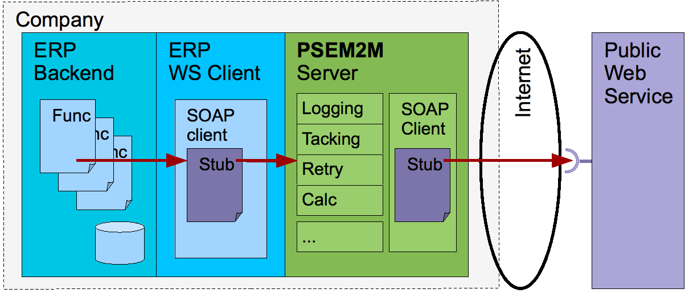

.. comment :

Cas d'usages de la plate forme
******************************

Pour pouvoir toujours assurer la transmission des messages qu'on lui confie et y répondre, un serveur d'échanges de données sans délai doit être plus fiable que les émetteurs et récepteurs de messages qu'il sert et il doit pouvoir s'affranchir de l'état des moyens de communication qu'il utilise.

Pour ces deux raisons, les logiciels serveur d'échanges de données sans délai sont un cas d'emploi de la plate-forme PSEM2M.

Ci après des cas d'usage d'un serveur d'échanges de données sans délais.

Cas d'usage des serveurs d'échanges
***********************************

Domaine de la gestion
=====================

Echanges entrant vers un ERP
----------------------------

Scénario « article »
^^^^^^^^^^^^^^^^^^^^

Une application « Web » ( le logiciel client) interroge un ERP (le logiciel serveur) pour obtenir des quantités en stock pour les afficher dans des pages d'un catalogue en ligne.

Le serveur d'échange localisé sur la même machine que le serveur Web retourne toujours des quantités même si la requête n'a pas pu atteindre l'ERP.

Les réponses dégradées sont calculées par le serveur d'échange sur la base des résultats des requêtes précédentes.
Un indice de qualité des données permet à l'application « Web » de présenter les données avec les réserves idoines.

Scénario « commande »
^^^^^^^^^^^^^^^^^^^^^

Une application « Web » ( le logiciel client) sollicite un ERP (le logiciel serveur) pour créer des commandes de ventes à partir des paniers des utilisateurs.

Le serveur d'échange localisé sur la même machine que le serveur Web accepte toujours les requêtes de création de commande et les mémorise dans le cas où l'ERP n'est pas joignable pour les soumettre en temps voulu.

L'utilisateur de l'application « Web » à ainsi toujours la confirmation que sa commande à bien été prise en compte même si elle n'a pas encore été transférée dans le système de gestion de l'entreprise.
Des mécanismes d'envoi de messages sur l'avancement de la commande 

Scénario pièce jointe
^^^^^^^^^^^^^^^^^^^^^

Une PME ayant choisi de dématérialiser le flux de document entrant met en place un atelier de numérisation des courriers entrant qui lui permet de créer des pièces dématérialisées indifférenciées dans son logiciel de gestion.

Ces pièces étant ensuite prises en compte par les opérateurs de gestion par le biais d'un système de plan de travail pour réaliser l'association d'une pièce dématérialisées avec un objet de gestion (cf.
commande, facture, réception,...) .

Un serveur d'échange spécialisé installé au plus près de l'opérateur de numérisation et de son outil va assurer l'adaptation protocolaire (cf.
SMPT / WebService) , le traçage et l'acquittement de l'envoi des pièces dans l'ERP, lui permettant ainsi d'apposer une mention «importée» sur les pièces physiques (ex.
impression par pistolet à jet d'encre ...).

Echanges sortant d'un ERP
-------------------------

Scénario « article prix »
^^^^^^^^^^^^^^^^^^^^^^^^^

Une entreprise cliente d'une place de marché envoi ses tarifs vers le référentiel de la place en utilisant un web service sécurisé (https + certificat client).

Après avoir produit le fichier de données attendu, l'ERP le confie à un serveur d'échange spécialisé qui va assurer l'adaptation protocolaire, le support du certificat client, le traçage des envois et l'envoi d'un message de confirmation au gestionnaire une fois l'acquittement de la place de marché reçu.

Domaine de la production
========================

Interface entre le monde réel et les applications de gestion.

Données médicales
-----------------

Pour tenir à jour les dossiers informatisés des patients, les établissement hospitaliers (public ou privé) doive organiser la collectes des paramètres physiologiques issus des appareillages de surveillances des patients au bloc opératoire ou dans les salles de réveil est un besoin 

Cette collecte répond à des règles médico-légale qui induisent que le système de collecte doit garantir que les données fournies par les appareillages spécialisés seront transmises intégralement au système de gestion des dossiers des patients .

Le serveur d'échange, installé sur une machine spécialisé (cf.
« appliance » à faible consommation) directement connecté à l'appareillage assure le rôle de garant de l'envoi des données en étant capable de passer outre les interruptions de service des moyens de communication et en fournissant une trace de toute l'activité de transmission et de consignation des données.

Suivi d'évolution d'un stock
----------------------------

Le processus de fabrication de pièces de bois d'oeuvre passant par une phase de séchage contrôlé, les entreprises du secteur se doivent de parcourir leur parc de stockage pour peser régulièrement leur lots et en consigner les valeurs mesurées.

Le serveur d'échange, installé sur une machine spécialisé (cf.
pc industriel) embarqué sur le véhicule de manutention et connecté à l'appareillage de mesure assure le rôle de guide de l'opérateur (cf.
écran tactile) et le garant de l'envoi des données en étant capable de passer outre les interruptions de service des moyens de communication 

Données du personnel
--------------------

Des terminaux lecteur de badges autonomes installés dans une PME collectent les mouvements des employés pour alimenter un module de gestion du personnel présent dans un ERP.

La simplicité de déploiement des terminaux autonomes (pas de logiciel serveur) induit que c'est à la charge du logiciel utilisateur des données de solliciter les terminaux pour lire les données qu'ils contiennent.

Le serveur d'échange, installé sur une machine spécialisé (cf.
« appliance » à faible consommation) va assurer les interrogations cycliques des lecteurs, la sécurisation des des données, les conversions de format, l'appel des points d'entrées d'importation du progiciel, la consignation de tous les évènements, le tout en gérant automatiquement toutes les reprises sur incident ( communication avec les terminaux ou avec l'ERP,etc ...)

Description détaillées
**********************

Echanges entrant vers un ERP
============================

.. image:: _static/images/picture_7.png
   :width: 600px
   :scale: 50%

Figure : traduction de requêtes REST vers un service web SOAP.

Scénario « article »
--------------------

Contexte
^^^^^^^^

Une application « Web » ( le logiciel client) interroge un ERP (le logiciel serveur) pour obtenir des quantités en stock pour les afficher dans des pages d'un catalogue en ligne.

Le logiciel serveur publie un service Web SOAP pour fournir ces données.

Un serveur d'échange est utilisé pour :

- adapter le protocole de requête: il est beaucoup plus simple d''émettre une requête REST depuis PHP

- toujours retourner une réponse à la requête REST pour simplifier la programmation de l'application « Web » 

- mémoriser les quantités en stock reçues pour pouvoir délivrer une approximation en cas de non réponse du logiciel serveur.

Le logiciel client envoi une requête REST de lecture (méthode HTTP GET) d'une liste de quantités par cellule en fonction d'un identifiant unique « article + site » présent dans l'URL sous forme d'un formulaire « url-encoded ».

Le logicel client reçoit dans tous les cas de fonctionnement une réponse HTTP transportant un document XML dans lequel sont listées les quantités attendues et un indice de qualité des données retournées : l'ancienneté de ces quantités (0: retournées par le serveur, n: données locale reçues il y a n millisecondes ).

Tourtes les quantités en stock reçues du logiciels serveur sont stockées localement pour que le serveur d'échange puisse délivrer un message dégradé en cas de non réponse du logiciel serveur (ex: quantité connues il y a n millisecondes).

La route
^^^^^^^^

Les étapes de la route composée dans le serveur d'échange :

- un composant serveur http reçoit les requêtes REST, il les converti en messages génériques ( pattern « message » )

- les messages sont consommés par un composant de mémorisation « post envoi » qui va créer un « slot » dans une base pour y associer les données a venir 

- les messages sont consommés par un composant traducteur qui va instancier les beans nécessaires à l'appel de la méthode du stub correspondant à l'action du service Web SOAP à appeler.
  L'instanciation des beans est le résultat d'une exécution d'un script (cf.
  pas de dépendance vers des classes.
  Ok dans Dlavik ).
  

- les messages sont consommés par un composant client SOAP qui lors de son activation, a instancié le stub nécessaire pour solliciter le service Web SOAP.
  A chaque message consommé, ce composant sollicite la méthode de l'action correspondante au message en utilisant les beans disponibles.

- Les réponses obtenues sont converties en message qui prennent le chemin inverse

- Le message réponse est consommé par le composant « traducteur » qui produit un DOM à partir des beans ou des exceptions.
  Ce DOM contient le timestamp de l'arrivée des données ou des erreurs

- Le message réponse est ensuite consommé par le composant de mémorisation « post envoi ». Si le message réponse est valide, les données sont stockées dans le « slot » créé . Si le message contient une exception, celle-ci est mémorisé et si le « slot » n'est pas vide, les données correspondant à la dernière lecture requête sont insérée dans le message 

- Le message est ensuite consommé par le composant serveur http, qui retourne une réponse http valide (200) au logiciel client

Dans ce scénario, pour pouvoir positionner les composants traducteur et client SOAP dans différents isolats il faut sérialiser les beans en utilisant une bibliothèque spécialisée (ex: Apache XmlBean).

Constitution et composition
^^^^^^^^^^^^^^^^^^^^^^^^^^^

Le logiciel serveur est constitués des composants:

- isolat 1

  - serveur service web REST

  - mémorisation post-envoi

- isolat 2 

  - traducteur 

  - client service web SOAP

Chacun de ces composants utilise le service de ISvcLog pour tracer leur activité.

Scénario « commande »
---------------------

Le contexte
^^^^^^^^^^^

Une application « Web » ( le logiciel client) sollicite un ERP (le logiciel serveur) pour créer des commandes de ventes à partir des paniers des utilisateurs.

Le logiciel serveur publie un service Web SOAP pour créer les commandes.

Un serveur d'échange est utilisé pour :

- adapter le protocole de requête: il est beaucoup plus simple d''émettre une requête REST depuis PHP

- toujours retourner une réponse à la requête REST pour simplifier la programmation de l'application « Web » 

- mémoriser les demandes de création pour pouvoir les relancer en différé lorsque le logiciel serveur est dans l'incapacité de fournir une réponse validant la création .

Le logiciel client envoi une requête REST de création (méthode HTTP PUT) d'une commande en transportant un message XML 

Le logiciel client reçoit dans tous les cas de fonctionnement une réponse HTTP transportant un document XML réponse contenant à minimal les données fournie et un message signifiant que la commande est en cours de traitement 

La commande est identifiée par un identifiant de panier unique : si l'ERP crée la commande et lui attribut un identifiant, l'UUID du panier perdure et permet de retrouver une commande non encore créée dans l'ERP, et permet de rejeter une éventuelle demande de création en double.

Note : Ce scénario peut compléter le scénario « article » en allant compléter les quantité en stock mémorisées par des mouvements négatif correspondant à chacune des lignes de commande validée.

Les routes
^^^^^^^^^^

Les étapes de la route composée dans le serveur d'échange :

- un composant serveur http reçoit les requêtes REST, il les converti en messages génériques ( pattern « message » )

- les messages sont consommés par un composant de mémorisation « pré envoi » qui va créer un « slot » dans une base pour y associer les données de la commande à créer 

- les messages sont consommés par un composant traducteur qui va instancier les beans nécessaires à l'appel de la méthode du stub correspondant à la création d'une commande

- les messages sont consommés par un composant client SOAP qui lors de son activation, a instancié le stub nécessaire pour solliciter le service Web SOAP.

- Les réponses obtenues sont converties en message qui prennent le chemin inverse

- Le message réponse est consommé par le composant « traducteur » qui produit un DOM à partir des beans ou des exceptions.
  Ce DOM contient le timestamp de l'arrivée des données ou des erreurs

- Le message réponse est ensuite consommé par le composant de mémorisation « pré envoi ». Si le message réponse est valide, le « slot » précédemment créé est supprimé. Si le message contient une exception, celle-ci est mémorisé et le « slot » est marqué pour ré-essai.

- Le message est ensuite consommé par le composant serveur http, qui retourne une réponse http valide (200) au logiciel client

Une deuxième route est initiée par un composant de ré-essai :

- le composant de ré-essai sollicite un composant spécialisé pour déterminer s'il peut fonctionner ( ex: test du « locator » du service web en demandant le WSDL du service ).
  dans l'affirmative il dépile les messages mémorisés marqués pour ré-essai.
  

- l'enchainement est le même sauf pour l'envoi de la réponse au logiciel client : le composant de ré-essai envoi le message à un client http qui envoi une requête REST de modification (méthode http POST) de l'état du panier identifié par l'UUID.

Constitution et composition
^^^^^^^^^^^^^^^^^^^^^^^^^^^

Le logiciel serveur est constitués des composants:

- isolat 1

  - serveur service web REST

  - mémorisation pré-envoi

- isolat 2 

  - traducteur 

  - client service web SOAP

- isolat 3 

  - ré-éssai

  - mémorisation pré-envoi

  - client service web REST

Chacun de ces composants utilise le service de ISvcLog pour logger leur activité

Scénario pièce jointe.
----------------------

A détailler

Des matériels pouvant être utilisé pour le scénario :

- Kodak ScanStation 500 (configuration)

- Canon iR 3225 (MEAP – java J2ME)

- Canon ScanFront_220 (configuration, add in Windows CE)

- PicAS, HANDJET® (EBS-2XX) Series - Industrial INK-JET Printers (DOD, LCP)

- http://www.ebs-inkjet.de/english/produkty_karta.php?id=134

Echanges sortant d'un ERP
=========================

   
Figure : gestion de requêtes vers un service web SOAP.

Scénario « article prix »
-------------------------

Une entreprise cliente d'une place de marché envoi ses tarifs vers le référentiel de la place en utilisant un web service sécurisé (https + certificat client)

A détailler

Domaine de la production
========================

Interface entre le monde réel et les application de gestion.

Collecte de données médicale
----------------------------

A détailler

Le serveur d'échange est utilisé pour :

- logging et time-stampage de chaque arrivée de donnée

- enregistrement local des données dans une mémoire tempon 

- envoi des données suivant la disponibilité de la chaîne de liaison

- logging et time-stampage de l’acquittement de la réception des données par le système distant

- suppression de la copie locale 

Evolution d'un stock
--------------------

A détailler

Données du personnel
--------------------

A détailler

Des matériels pouvant être utilisé pour le scénario :

- Terminal Horoquartz iTR10,

- export de données au format csv

