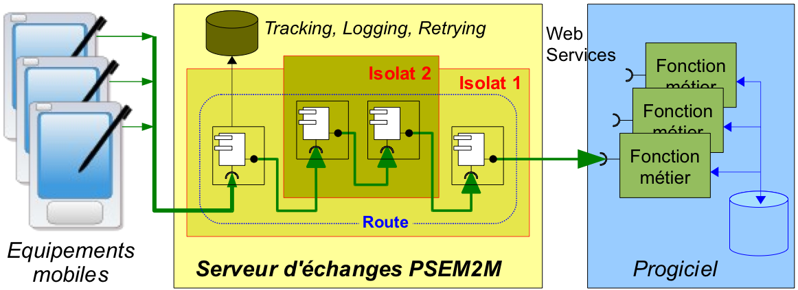

.. comnent:

Principes visés
***************

Les isolats
-----------

Avec cette plate-forme, un logiciel n'est plus envisagé comme une construction monolithique mais comme un ensemble de composants fonctionnels dialoguant entre eux et étant répartis dans de multiples isolats d'exécution.

Le fait que les isolats d'exécution soient indépendants les uns des autres (cf.
responsabilité du système d'exploitation) va permettre au logiciel de continuer à fonctionner malgré l'absence d'un d'entre eux.

Les isolats d'exécution critiques peuvent être doublés pour augmenter la fiabilité de l'ensemble.
Exemple, sur les systèmes d'exploitation qui le permettent, les flux réseau peuvent être confiés simultanément à deux auditeurs (cf.
isolats dans lesquels des sont lancé des bundles implémentant un serveur comme un serveur httpd ).

.. image:: _static/images/picture_4.png
   :width: 600px
   :scale: 50%
   
Avec la plate-forme PSEM2M, un logiciel est décrit : c'est une composition.

Lors du démarrage, la description est lue par un superviseur qui va gérer le démarrage de chacun des isolats d'exécution en lui fournissant sa configuration.

Lors du démarrage d'un isolat, ses composants chargés et activés. Ils publient les services qui vont leur permettre de dialoguer entre eux.

En cas de défaillance d'un isolat d'exécution, les services qu'il publie disparaissent.
Les composants qui en dépendent de façon optionnelle continuent de vivre après avoir été notifiés de cette disparition.

Pour garantir la continuité de fonctionnement, un composant peut demander à utiliser n services similaires.
Un critère de choix permettant d'utiliser prioritairement par exemple le plus efficace.
En cas de défaillance de celui utilisé, le composant consommateur pourra se rabattre sur un service alternatif.

En cas de défaillance d'un isolat, le superviseur tentera de le redémarrer (cf.
« jeunification »).

Les services
------------

Deux types de composants cohabitent dans la plate-forme : les composant délivrant des services spécifiques et ceux délivrant des services génériques

Les services spécifiques ont des interface explicites.
Exemple :

- le service de logging,

- le service d'accès à la configuration du logiciel

- ...

Les services génériques sont ceux qui permettent de manipuler des « messages » dans le sens défini par les « Enterprise Integration Patterns ».

la composition
--------------

Lorsque le superviseur lance un isolat d'exécution, il lui fournit une configuration listant les composants à charger et à démarrer

Ces derniers peuvent porter explicitement des dépendances vers des services spécifiques (ex: service de log).

Ces composants peuvent être aussi des pourvoyeurs ou des consommateurs de services génériques mais ces dépendances (cf.
consommation) ne sont pas exprimées dans les composants eux même.

Les liens entre les composants via les services génériques sont établis en fin de démarrage de l'isolat sur la base de la lecture d'un descripteur.

L'ensemble de ces liens constitue une route

   
Plusieures routes peuvent être décrites.
Lorsque la route prioritaire ne peut fonctionner, une route secondaire est employée ( cf.
comportement d'auto réparation : « Autonomic computing »).

