.. installation des plug-ins

The Eclipse plug-ins
####################

Below, the list of the installed plu-ins.

eGit
====

Select in the Eclipse Market

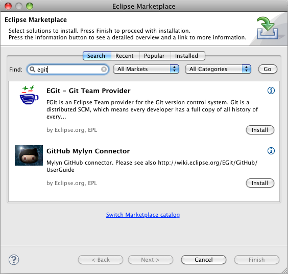

hunspell4Eclipse
================

Select in the Eclipse Market

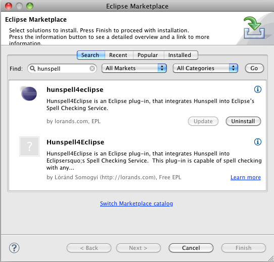

The configuration

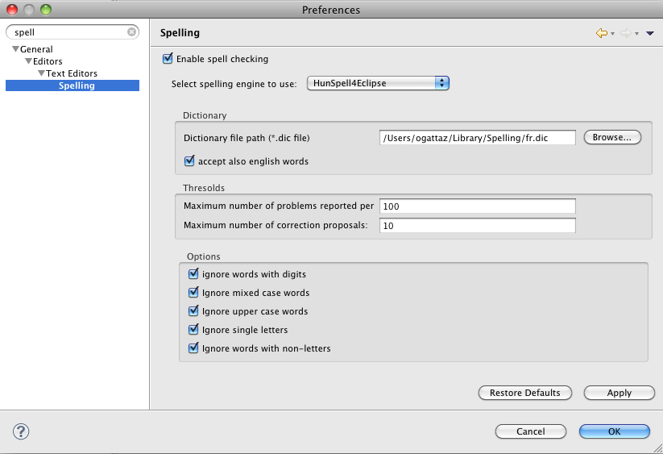

Rest Editor
===========

Select in the Eclipse Market

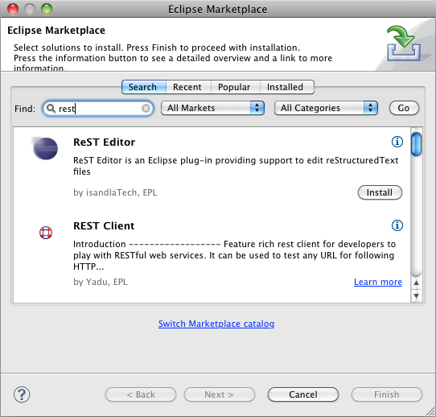

The configuration

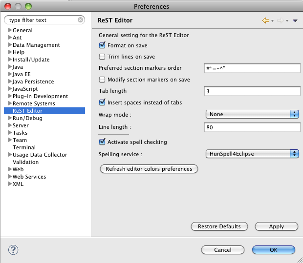

felix-eclipse
=============

felix-eclipse is a plugin for the Eclipse Plugin Development Environment (PDE) that integrates Apache Felix as an OSGi framework in Eclipse. It makes it easy to debug Apache Felix as an Eclipse target platform.
https://code.google.com/p/felix-eclipse/

The installation procedure is detailled here :
https://code.google.com/p/felix-eclipse/wiki/Installation

Create a new software site selecting the dowloaded archive file :

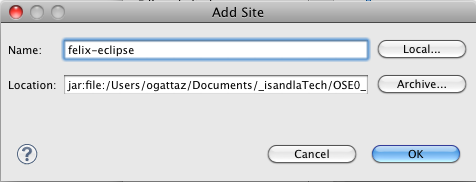

The new software site :

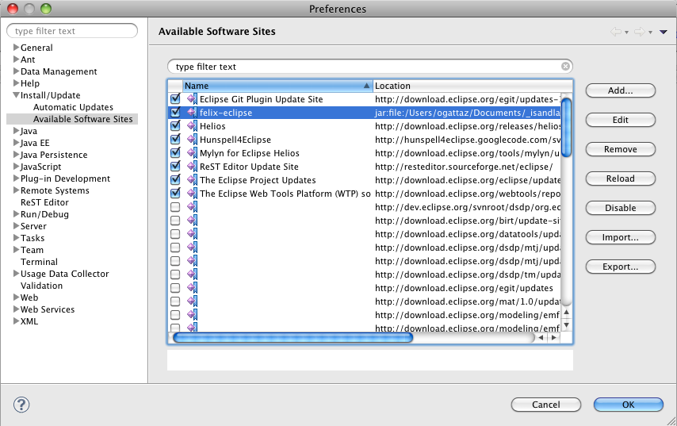
   
The message shown after the "reloading" of the content of the archive file :

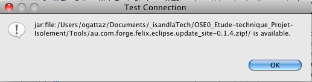

The selection of the feature available in the software site :

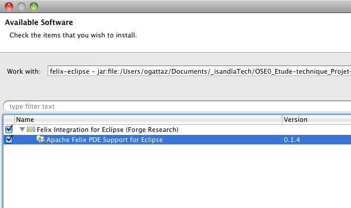

iPojo builder
=============

Create a new software site giving the url : http://forge.isandlatech.com:3080/eclipse/

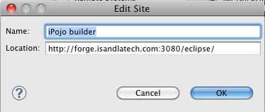

The new software site :

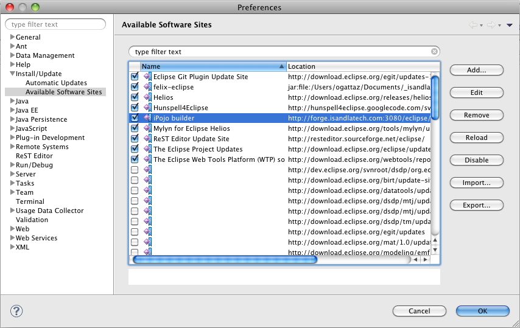
   
The message shown after the "reloading" of the content of the archive file :

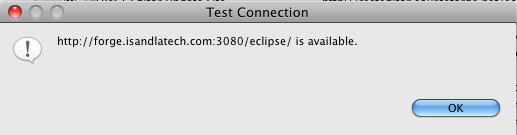

The selection of the feature available in the software site :

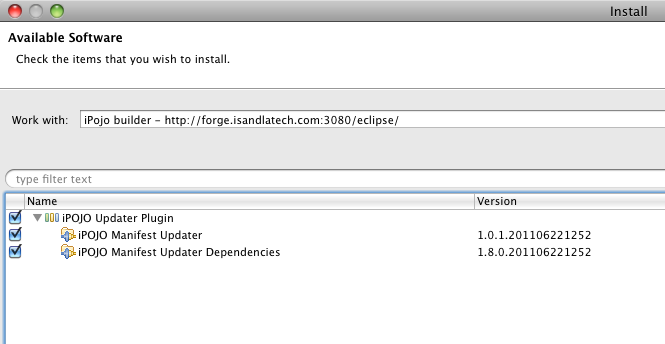

 